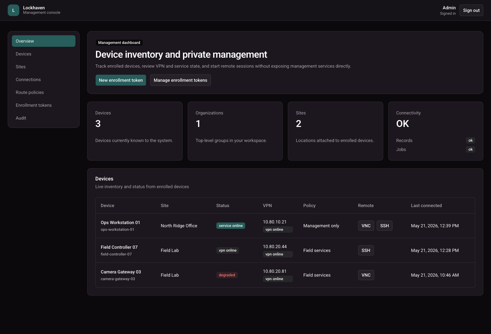
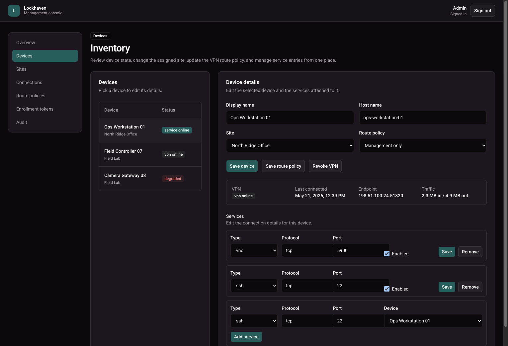

# Lockhaven

Protected access for remote infrastructure.

Lockhaven is a WireGuard-backed access platform for enrolling remote clients,
maintaining private connectivity, tracking device inventory, and reaching
services like VNC, SSH, SQL, and internal web apps without exposing devices
directly.

Repository: [`nic-southern/lockhaven`](https://github.com/nic-southern/lockhaven)

## Screenshots





## Product Suite

Lockhaven is built as a foundation for a broader remote infrastructure access
suite:

- `Lockhaven Hub` - central control plane for organizations, sites, devices,
  policies, sessions, audit history, and admin access.
- `Lockhaven Agent` - lightweight client-side enrollment and check-in service
  for managed endpoints.
- `Lockhaven Console` - web interface for inventory, access, health, and
  operational workflows.
- `Lockhaven Gateway` - private access entry point for service sessions and
  policy enforcement.
- `Lockhaven Relay` - connectivity layer for reaching constrained or
  hard-to-route environments.

This repository currently contains the Hub, Console, Gateway-adjacent service
launch flow, WireGuard reconciliation worker, deployment automation, and shared
domain packages.

## What It Does

- Enrolls devices into a private WireGuard management network.
- Tracks device, site, organization, route policy, and service inventory.
- Launches private service sessions without opening inbound access on devices.
- Refreshes VPN peers and service health from a background worker.
- Records audit events for sensitive administrative activity.
- Supports customer-facing product naming through `PRODUCT_NAME`.

## Architecture

- `apps/web` - Next.js console, session UI, tRPC route handlers, auth routes,
  enrollment endpoints, and health checks.
- `apps/worker` - WireGuard reconciliation and management service health jobs.
- `packages/shared` - domain schemas and shared product types.
- `packages/db` - database schema, migrations, and admin bootstrap script.
- `packages/auth` - authentication and authorization helpers.
- `packages/vpn` - WireGuard command builders and VPN state parsing.
- `packages/remote-access` - remote service connection provisioning.
- `packages/api-contract` - tRPC router, procedures, and API schemas.
- `deploy/` - production Docker Compose definition.
- `infra/` - droplet bootstrap, systemd helpers, and Terraform provisioning.
- `scripts/` - deployment and enrollment helpers.

## Local Development

- `pnpm install`
- `pnpm dev:web`
- `pnpm dev:worker`
- `pnpm test`
- `pnpm format:check`
- `pnpm --filter @nms/db db:migrate`
- `ADMIN_EMAIL=admin@example.com ADMIN_PASSWORD='set-a-password' pnpm db:bootstrap-admin`
- `pnpm build`
- `pnpm lint`
- `pnpm typecheck`

## Configuration

Copy `/.env.example` to `/.env`, then generate the placeholders shown there:

- `openssl rand -hex 16` for `POSTGRES_PASSWORD`, `GUACAMOLE_DB_PASSWORD`, and `ADMIN_PASSWORD`
- `openssl rand -hex 32` for `REMOTE_CREDENTIALS_KEY` and `BETTER_AUTH_SECRET`
- `VPN_SERVER_PUBLIC_KEY` is generated by `scripts/deploy-production.sh` in
  production. For local development, set it to the public key for your local
  VPN interface.

Set `PRODUCT_NAME` to white-label the customer-facing web app name. It defaults
to `Lockhaven`.

## Production Deployment

Lockhaven supports two production paths:

1. **Terraform deploy** - use `/.env.stage` and `scripts/deploy-production.sh`
   to provision the host, generate `.env.deploy`, copy the Compose file, start
   the stack, run migrations, and refresh the admin user.
2. **DIY existing host** - use Docker Compose directly on a host you already
   manage. You only need `deploy/production.compose.yml` and a populated
   `.env.deploy`; you do not need to clone this repository onto the server.

### Path A: Terraform Deploy

Use this path when you want Lockhaven to create and bootstrap the production
DigitalOcean droplet. The default Terraform provider config is set up for
DigitalOcean.

1. Copy `/.env.stage.example` to `/.env.stage`.
2. Edit `/.env.stage` with environment-specific values, especially hostnames,
   droplet settings, image pull credentials, admin credentials, and
   `PRODUCT_NAME`.
3. Copy `infra/terraform/provider.tf.example` to `infra/terraform/provider.tf`.
   Change this provider config only if you are adapting the Terraform path away
   from the default DigitalOcean setup.
4. Put `DO_TOKEN` in `/.env.stage` or export `TF_VAR_do_token`.
5. Run:

```bash
scripts/deploy-production.sh
```

The script writes `infra/terraform/terraform.tfvars`, generates local
`.env.deploy` from `/.env.stage`, provisions the droplet, copies
`deploy/production.compose.yml` and `.env.deploy` to the host, starts the stack,
applies database migrations, and refreshes the admin user.

`/.env.stage` may contain bootstrap-only values such as `GHCR_USER`,
`GHCR_READ_TOKEN`, and `DO_TOKEN`. These are used by the deploy script but are
not copied into the generated `.env.deploy`.

Key `.env.stage` values:

- `PRODUCT_NAME` - customer-facing name shown in the web app.
- `GHCR_USER` - GitHub username or machine user for image pulls.
- `GHCR_READ_TOKEN` - token with `read:packages` access.
- `SSH_KEY_NAME` - SSH key name already uploaded to DigitalOcean.
- `ACME_EMAIL` - contact email used for certificate issuance.
- `ADMIN_EMAIL` and `ADMIN_PASSWORD` - admin account refreshed after each
  production deploy.
- `DO_TOKEN` - DigitalOcean API token, or export the same value as
  `TF_VAR_do_token`.

The droplet bootstrap installs Docker from Docker's apt repository and uses
`iptables` rules in the `DOCKER-USER` chain for host access control.
The deploy script also creates the host VPN keypair, writes
`VPN_SERVER_PUBLIC_KEY` into `/.env.deploy`, and starts the server interface.

To rerun the bootstrap against an existing droplet without touching Terraform,
set `DEPLOY_ONLY=1` and provide `DEPLOY_HOST`.

## Client Enrollment

Create an enrollment token in the Console, then run the installer on the remote
client. The deployed web app serves the current installers from the `/install`
path.

Windows PowerShell:

```powershell
$VpnHost = "https://<vpn-hostname>"; $Token = "<enrollment-token>"; $Script = "$env:TEMP\lockhaven-enroll.ps1"; Invoke-WebRequest -Uri "$VpnHost/install/enroll-windows.ps1" -OutFile $Script; powershell.exe -ExecutionPolicy Bypass -File $Script -Token $Token -BaseUrl $VpnHost
```

Linux:

```bash
VPN_HOST="https://<vpn-hostname>"; curl -fsSL "$VPN_HOST/install/enroll-linux.sh" | sudo LOCKHAVEN_TOKEN="<enrollment-token>" LOCKHAVEN_BASE_URL="$VPN_HOST" bash
```

Use the deployed VPN hostname for `<vpn-hostname>`, for example the value of
`VPN_PUBLIC_HOSTNAME` in your environment.

SOC enrollment commands are available in the Console when `SOC_BASE_URL` and
`WAZUH_AGENT_ENROLLMENT_PASSWORD` are configured. The current SOC host is
`https://soc.newmarketsecurity.com`, and Windows endpoint enrollment uses the
`windows-endpoint` device role.

### Path B: DIY Existing Host

Use this path when you already have a Linux host with Docker and Docker Compose.
The host must allow inbound `80/tcp`, `443/tcp`, and the WireGuard UDP port
configured by `VPN_PUBLIC_PORT` (default `51820`).

You do not need the full repository on the server. Create an app directory with
this shape:

```text
/opt/lockhaven/
  .env.deploy
  deploy/
    production.compose.yml
```

Copy `deploy/production.compose.yml` from this repository to the server, then
create `.env.deploy` beside the `deploy` directory. Start from `/.env.example`,
set `APP_ENV=production`, and include the production-only values that the
Compose file and containers need:

- `PRODUCT_NAME`
- `APP_BASE_URL`, `BETTER_AUTH_URL`, `NEXTAUTH_URL`, and
  `NEXT_PUBLIC_APP_URL`
- `ROOT_DOMAIN`, `APP_HOSTNAME`, `GUAC_HOSTNAME`, and `ACME_EMAIL`
- `GUACAMOLE_BASE_URL`, `GUACAMOLE_DATABASE_URL`, and
  `GUACAMOLE_API_SESSION_TIMEOUT`
- `DATABASE_URL` and `REDIS_URL`
- `POSTGRES_PASSWORD` and `GUACAMOLE_DB_PASSWORD`
- `BETTER_AUTH_SECRET` and `REMOTE_CREDENTIALS_KEY`
- `VPN_PUBLIC_HOSTNAME`, `VPN_PUBLIC_PORT`, `VPN_SERVER_IP`,
  `VPN_DEFAULT_ALLOWED_IPS`, `WIREGUARD_INTERFACE`, and `VPNCTL_PATH`
- `REMOTE_ACCESS_PROVIDER`
- `ADMIN_EMAIL`, `ADMIN_PASSWORD`, `ADMIN_NAME`, and `ADMIN_ROLE`
- `WEB_IMAGE` and `WORKER_IMAGE`

You can use the published Lockhaven images directly; you only need to build and
publish your own images if you are customizing the app. Set:

```bash
WEB_IMAGE=ghcr.io/nic-southern/lockhaven-web:<tag>
WORKER_IMAGE=ghcr.io/nic-southern/lockhaven-worker:<tag>
```

Then log in to GHCR and start the stack:

```bash
cd /opt/lockhaven
printf '%s\n' "$GHCR_READ_TOKEN" | docker login ghcr.io -u "$GHCR_USER" --password-stdin
docker compose --env-file .env.deploy -f deploy/production.compose.yml pull
docker compose --env-file .env.deploy -f deploy/production.compose.yml up -d --remove-orphans
```

After the data services are healthy, apply migrations and refresh the admin
account through the internal one-shot `migrate` service:

```bash
docker compose --env-file .env.deploy -f deploy/production.compose.yml run --rm migrate
```

## Image Pull Credentials

Production hosts need permission to pull the Lockhaven images from GHCR.

For the Terraform deploy path, set these in `/.env.stage`:

- `GHCR_USER` - GitHub username or machine user used for `docker login`.
- `GHCR_READ_TOKEN` - GitHub token with `read:packages` access.

For the DIY existing-host path, use the same credentials directly on the host
before running `docker compose pull`:

```bash
printf '%s\n' "$GHCR_READ_TOKEN" | docker login ghcr.io -u "$GHCR_USER" --password-stdin
```

If the package is private, the token may also need `repo` access for the account
or machine user that owns the package.

## Terraform Pre-Flight

Before `terraform init`, make sure you have:

- a DigitalOcean personal access token with droplet, firewall, and DNS
  permissions
- the name of an SSH key already uploaded to DigitalOcean, matching
  `ssh_key_name`
- the matching private key loaded in your SSH agent for Terraform file copies
- a local `provider.tf` copied from `infra/terraform/provider.tf.example`
- a staged root file at `/.env.stage`
- `DO_TOKEN` set in `/.env.stage`, or `TF_VAR_do_token` exported in your shell

## Notes

- Container images publish as `lockhaven-web` and `lockhaven-worker`.
- `PRODUCT_NAME` changes visible product naming, not package names, database
  names, or host paths.
