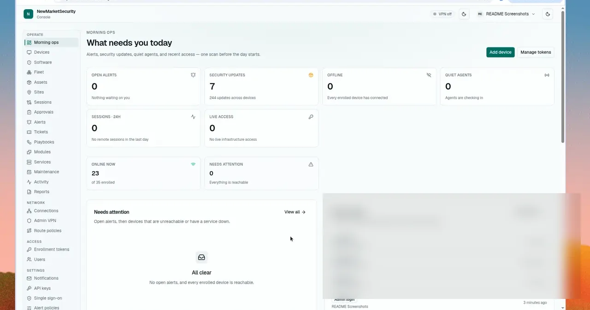
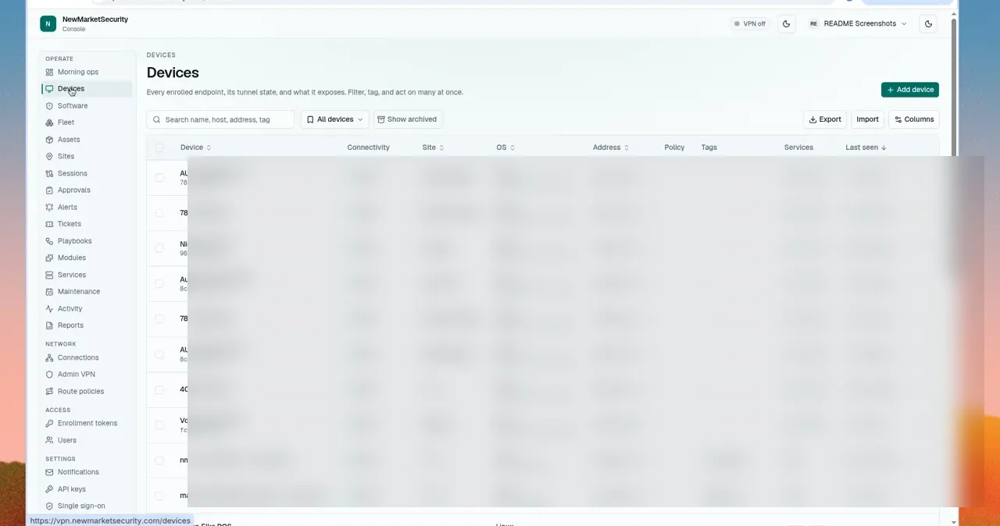
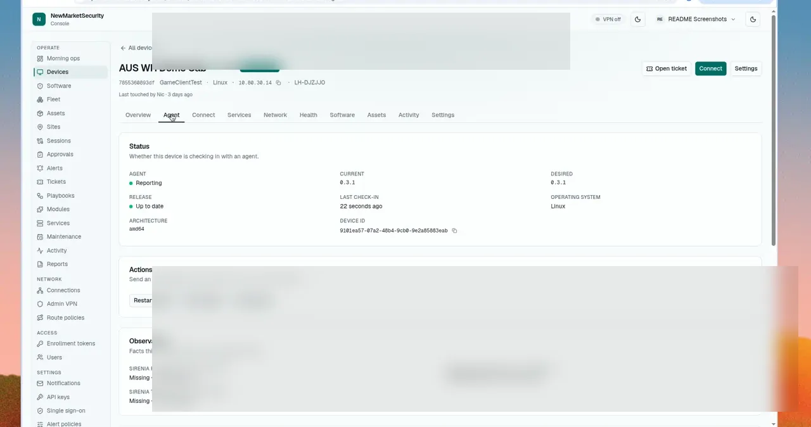
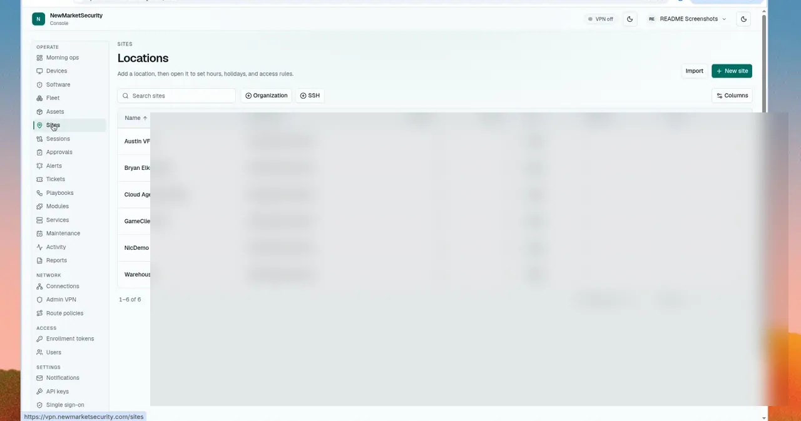
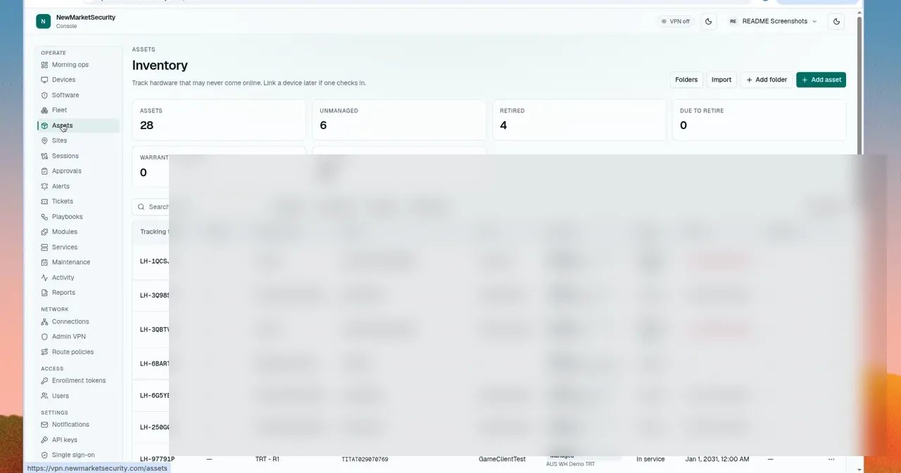
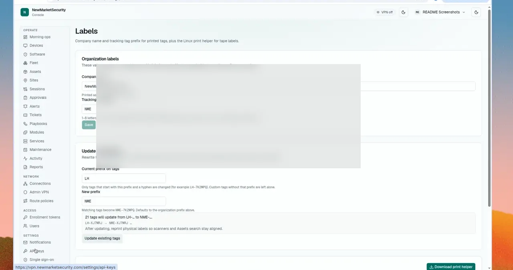
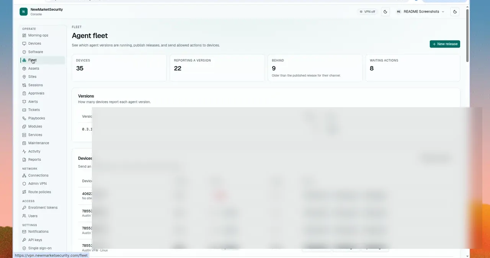
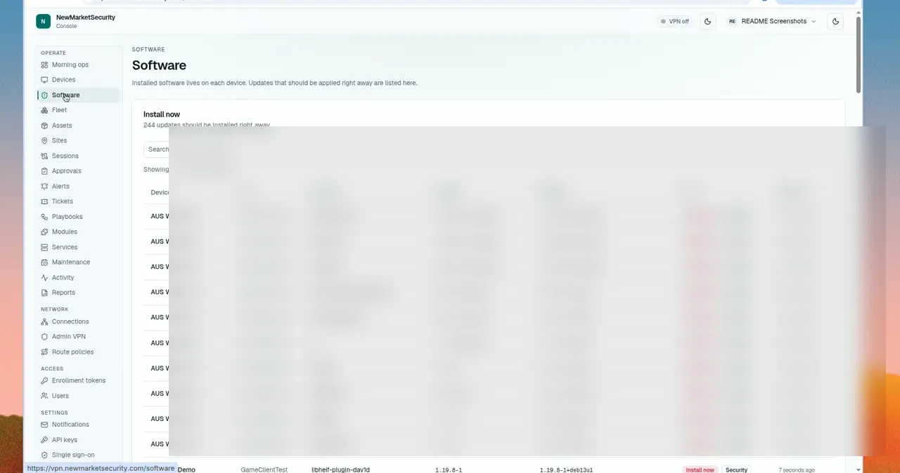
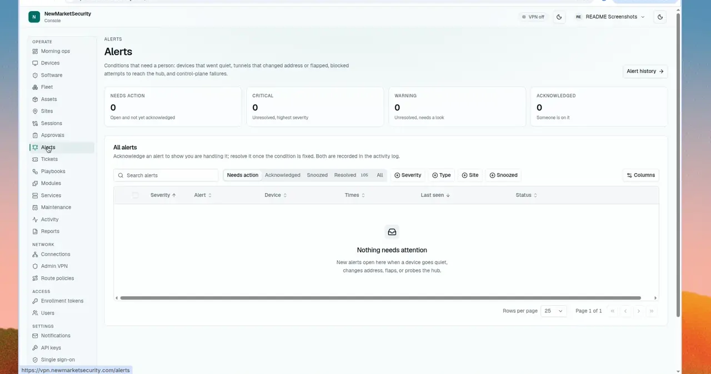
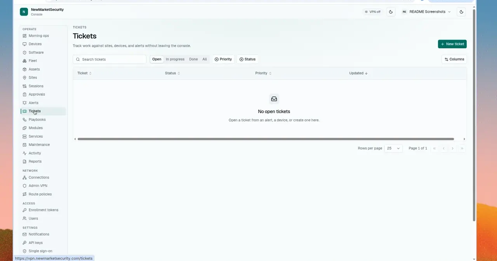

# Lockhaven

**Protected access for remote infrastructure.**

Lockhaven enrolls endpoints into a private management network, keeps inventory
and health in one place, and opens remote sessions without exposing devices to
the public internet.

This repository is the open Hub, Console, agent, Field app, worker, and deploy
tooling for Lockhaven.



<p align="center"><em>Morning ops — one scan before the day starts.</em></p>

## Product suite

| Component   | Role                                                                                         |
| ----------- | -------------------------------------------------------------------------------------------- |
| **Hub**     | Control plane for organizations, sites, devices, policies, sessions, audit, and admin access |
| **Agent**   | Static Linux and Windows client: attach, enroll, check-in, and signed self-update            |
| **Console** | Web UI for inventory, fleet, alerts, tickets, software, assets, and operations               |
| **Gateway** | Private service access and policy enforcement for remote sessions                            |
| **Relay**   | Connectivity layer for constrained or hard-to-route environments                             |
| **Field**   | Desktop technician app (Linux, Windows, macOS) for on-site inventory and scan flows          |

Customer-facing naming can be white-labeled with `PRODUCT_NAME` (defaults to
`Lockhaven`). Screenshots below are from a live deployment with a custom product
name; inventory rows are blurred.

## What you get

- **Private connectivity** — Enroll devices into a WireGuard management network; launch VNC, SSH, and related sessions without inbound exposure on the device.
- **Morning ops** — Start the day on open alerts, security updates, offline devices, quiet agents, recent sessions, and live infrastructure access.
- **Fleet and agent lifecycle** — Track agent versions, queue restart/update actions, and offer signed self-update when an operator, playbook, or after-hours step asks for it.
- **Sites, assets, and folders** — Inventory that is not only VPN devices: tracking tags, folders/containment, labels, and site placement for field work.
- **Software inventory** — Packages and install-now security updates reported by the agent.
- **Alerts, tickets, and playbooks** — Operate from open alerts through in-Console tickets and closed-whitelist automation.
- **Access controls** — Enrollment tokens, route policies, SSO/passkeys, infrastructure just-in-time access, and audit history.

## Console

### Morning ops

The landing view for operators (see hero above): tiles for what needs attention,
with deep links into alerts, software, devices, and activity.

### Devices and remote access

Every enrolled endpoint, tunnel state, tags, and quick session actions. Device
detail covers health, services, software, linked assets, and the **Agent** tab.





### Sites, assets, and labels

Sites group locations. Assets carry tracking tags, optional folders
(containment), serials, and device-model costs. Export or print labels from
Console; USB printing stays on the operator laptop.







### Fleet and software

Fleet shows agent version distribution and allowed actions (`restart` device,
`restart` agent, `update` agent). Software surfaces install-now updates from
agent check-ins.





### Alerts and tickets

Acknowledge, snooze, and resolve alerts. Open tickets next to the same devices
and sites — including create-from-alert — without leaving Console.





## Agent

The endpoint agent is a **static** Linux and Windows binary
(`apps/lockhaven-agent`):

- **Attach** to a device Hub already knows (no duplicate VPN peer).
- **Enroll** greenfield hosts when inventory does not exist yet.
- **Check in** with metrics, packages, titles, modules, and chassis serial when
  available.
- **Commands** stay a closed whitelist: `reboot`, `restart`, `update`.
- **Self-update** downloads only the Hub offer, verifies checksum, then swaps
  the binary. Updates are operator-queued (or playbook / after-hours) — not
  silent.

Installers are served from the deployed Hub under `/install`. See
[docs/enrollment.md](docs/enrollment.md).

## Field technician app

`apps/lockhaven-field` is a Flutter desktop app for site visits: browser
sign-in handoff, site and asset browse, find-by-scan, add asset, folder
reassign, and label handoff to the local print helper. It complements Console;
it does not replace admin, SSO, or fleet ops. Targets: Linux, Windows, macOS.

```bash
cd apps/lockhaven-field
# Linux:
flutter run -d linux --dart-define=HUB_BASE_URL=https://<console-host>
# Warehouse Mac (see apps/lockhaven-field/README.md):
flutter run -d macos --dart-define=HUB_BASE_URL=https://<console-host> \
  --dart-define=LABEL_PRINT_SCRIPT=$PWD/../../scripts/print-asset-labels.sh
```
## Architecture (concise)

```text
Console / Field ──► Hub (web + API) ──► Postgres / Redis
                         │
                         ├── Agent check-in / enroll / attach
                         ├── Remote session provisioning
                         └── Worker: VPN peers, health, alert evaluation
```

| Path                   | Purpose                                                    |
| ---------------------- | ---------------------------------------------------------- |
| `apps/web`             | Console, auth, enrollment, tRPC, health                    |
| `apps/lockhaven-agent` | Linux/Windows endpoint agent                               |
| `apps/agent`           | TypeScript protocol reference (macOS path)                 |
| `apps/lockhaven-field` | Field desktop app                                          |
| `apps/worker`          | WireGuard reconciliation and health jobs                   |
| `packages/*`           | Shared schemas, db, auth, vpn, remote-access, api-contract |
| `deploy/`              | Hosted Compose stack                                       |
| `infra/`               | Host bootstrap, systemd helpers, Terraform                 |
| `docs/`                | Deployment, enrollment, fleet, safety                      |

Deeper notes: [docs/architecture.md](docs/architecture.md),
[docs/threat-model.md](docs/threat-model.md).

## Getting started (developers)

```bash
pnpm install
cp .env.example .env   # fill secrets; see Configuration below
pnpm --filter @nms/db db:migrate
ADMIN_EMAIL=admin@example.com ADMIN_PASSWORD='set-a-password' pnpm db:bootstrap-admin
pnpm dev:web           # Console
pnpm dev:worker        # optional local worker
pnpm test
pnpm lint && pnpm typecheck && pnpm format:check
```

Useful scripts:

| Command                            | Purpose                   |
| ---------------------------------- | ------------------------- |
| `pnpm dev:web`                     | Console + Hub API         |
| `pnpm dev:worker`                  | Background reconciliation |
| `pnpm build`                       | Release builds            |
| `pnpm --filter @nms/db db:migrate` | Apply migrations          |
| `pnpm db:bootstrap-admin`          | Create/refresh admin user |

## Configuration

Copy `.env.example` to `.env`, then generate placeholders:

- `openssl rand -hex 16` for `POSTGRES_PASSWORD`, database passwords used by remote-session services, and `ADMIN_PASSWORD`
- `openssl rand -hex 32` for `REMOTE_CREDENTIALS_KEY` and `BETTER_AUTH_SECRET`

Set `PRODUCT_NAME` to white-label Console and auth naming. It defaults to
`Lockhaven` and does not rename container images, database names, or host paths.

## Hosted deploy

Images `lockhaven-web` and `lockhaven-worker` publish to GHCR from `main`.
The live host is **not** updated automatically.

When ready, run **Actions → Deploy → Run workflow** and type `deploy` to
confirm. That job SSHs to the host, syncs Compose and host helpers, pulls
images, migrates, and restarts. Requires repository secrets `DEPLOY_HOST` and
`DEPLOY_SSH_PRIVATE_KEY` (optional `DEPLOY_SSH_USER`).

Full paths (Terraform bootstrap, DIY existing host, image pull credentials):
**[docs/deployment.md](docs/deployment.md)**.

Host layout defaults to `/opt/lockhaven`.

## Client enrollment (quick)

Create an enrollment token in Console, then install on the device. Use your
deployed Hub hostname for `<vpn-hostname>`.

**Linux (agent):**

```bash
VPN_HOST="https://<vpn-hostname>"
curl -fsSL "$VPN_HOST/install/install-lockhaven-agent.sh" \
  | sudo LOCKHAVEN_TOKEN="<enrollment-token>" LOCKHAVEN_BASE_URL="$VPN_HOST" bash
```

**Windows (agent):**

```powershell
$VpnHost = "https://<vpn-hostname>"; $Token = "<enrollment-token>"
$Script = "$env:TEMP\install-lockhaven-agent.ps1"
Invoke-WebRequest -Uri "$VpnHost/install/install-lockhaven-agent.ps1" -OutFile $Script
powershell.exe -ExecutionPolicy Bypass -File $Script -Token $Token -BaseUrl $VpnHost
```

Tunnel-only and Android helpers are documented in
[docs/enrollment.md](docs/enrollment.md).

## Safety

- Do not commit secrets, private keys, state files, or real inventory.
- Prefer example values and sanitized screenshots.
- See [docs/public-repo-safety.md](docs/public-repo-safety.md).

## Docs

- [Deployment](docs/deployment.md)
- [Enrollment](docs/enrollment.md)
- [Fleet / agent updates](docs/fleet.md)
- [Architecture](docs/architecture.md)
- [Infrastructure access](docs/infrastructure.md)
- [SSO](docs/sso.md)
- [Database](docs/database.md)

## Repository

Public source for Lockhaven Hub, Console, agent, Field, and deploy tooling.
See the GitHub remote configured for this checkout.
